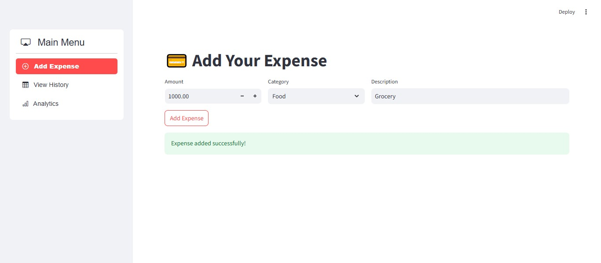
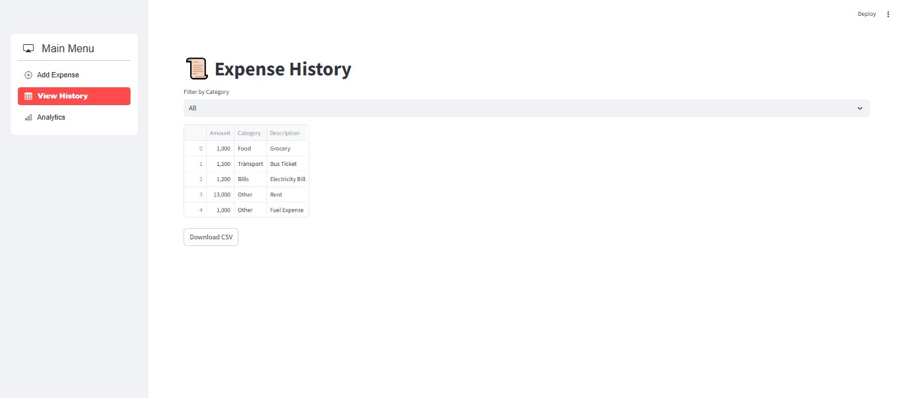
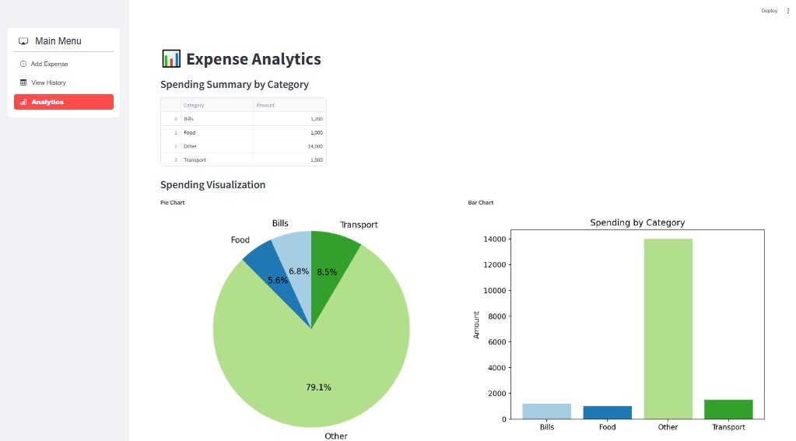

# <h1 align="center">💰 Personal Expense Tracker</h1>

  A simple web application built with <strong>Streamlit</strong> to track and visualize personal expenses. Easily add your daily expenses, view them in a table, and get visual insights through charts.

<h2>📝 Table of Contents</h2>
<ul>
  <li><a href="#about">About</a></li>
  <li><a href="#features">Features</a></li>
  <li><a href="#installation">Installation</a></li>
  <li><a href="#usage">Usage</a></li>
  <li><a href="#technologies">Technologies</a></li>
  <li><a href="#contributing">Contributing</a></li>
  <li><a href="#license">License</a></li>
</ul>

<h2 id="about">💡 About</h2>

  This <strong>Personal Expense Tracker</strong> allows you to easily manage your daily expenses, track your spending by categories, and visualize your financial behavior through pie and bar charts. It's built using <strong>Streamlit</strong> and Python for a smooth user interface and backend functionality.

<h2 id="features">🔧 Features</h2>
<ul>
  <li>Add new expenses with details such as amount, category, and description.</li>
  <li>View your recorded expenses in a tabular format.</li>
  <li>Filter expenses by category (Food, Transport, Bills, etc.).</li>
  <li>Get visual insights with pie and bar charts summarizing your spending by category.</li>
  <li>Download your expense data as a CSV file for further analysis.</li>
</ul>

<h2 id="installation">⚙️ Installation</h2>

To run the Personal Expense Tracker on your local machine, follow these steps:

<pre>
<code>
# Clone the repository
git clone https://github.com/yourusername/personal-expense-tracker.git

# Navigate into the project directory
cd personal-expense-tracker

# Install the required dependencies
pip install -r requirements.txt
</code>
</pre>

<h2 id="usage">🚀 Usage</h2>

Once the dependencies are installed, you can start the application with the following command:

<pre>
<code>
streamlit run app.py
</code>
</pre>

This will open a local server where you can interact with the expense tracker via your browser.

<h2 id="technologies">🛠️ Technologies Used</h2>
<ul>
  <li><strong>Streamlit</strong> - Framework for building web applications with Python.</li>
  <li><strong>Pandas</strong> - For data manipulation and managing expense data.</li>
  <li><strong>Matplotlib</strong> - For visualizing data with pie and bar charts.</li>
  <li><strong>Streamlit Option Menu</strong> - For creating a navigation sidebar to switch between different views.</li>
  <li><strong>Python</strong> - Backend logic and data processing.</li>
</ul>

<h2 id="contributing">🤝 Contributing</h2>

If you'd like to contribute to this project, please fork the repository and submit a pull request with your changes. Contributions are always welcome!

<h2 id="license">📄 License</h2>

This project is licensed under the MIT License - see the <a href="LICENSE">LICENSE</a> file for details.

<h2 id="styling">🎨 Styling Details</h2>

  The app is styled using custom CSS defined in the Streamlit app. The following styles have been implemented:

<ul>
  <li><strong>Navbar/Menu:</strong> A sidebar menu is created using <code>streamlit_option_menu</code>, which allows easy navigation between different sections (Add Expense, View History, Analytics).</li>
  <li><strong>Buttons:</strong> Custom-styled buttons are used for actions like adding expenses and downloading data. The buttons change colors on hover for a better user experience.</li>
  <li><strong>Visualization:</strong> The pie chart and bar chart are generated using Matplotlib, with color customization to make the visuals more appealing and accessible.</li>
  <li><strong>Responsive Design:</strong> The layout adjusts dynamically for different screen sizes using Streamlit's native responsive design properties.</li>
</ul>

<h2>📸 Screenshots</h2>

Here's a preview of what the application looks like:

The app allows you to add expenses, view your history, and analyze your spending with interactive visualizations.

<h2>💬 Feedback</h2>

If you encounter any issues or have suggestions for improvement, feel free to open an issue on this repository. I would love to hear your thoughts!

Made with ❤️ by <strong>Faisal Rafiq</strong>

